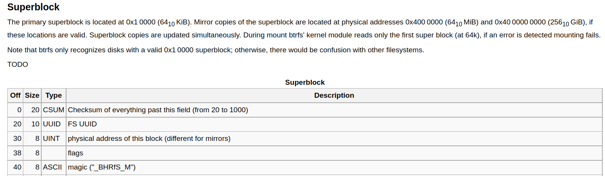

# CTFCup 2022 | Battles / Main | Forensics

## Название

> bread-and-butter

## Описание

> На компьютере нашего коллеги какая-то непонятная проблема, не посмотришь? Он пока вышел выпить кофе и съесть бутерброд с маслом.
> Логин `user`, пароль `user`. Не забудь включить `EFI` в virtualbox!

## Раздатка

Диск виртуальный машины:

* [ubuntu_server.vdi.zip](https://drive.google.com/file/d/1ezMcMvnbFXJl5QHMmhOWEXNmlZlVrNVd/view?usp=sharing) (sha1sum 2fcd560fddebc175d67efdd24f7f57631cedc1cc)

## Решение

История команд при включении виртуальной машины небольшая:

```
sudo losetup /dev/loop956 file
sudo mkdir /mnt/point
sudo mount /dev/loop956 /mnt/point
sleep 300 && notify-send "send letter to John, can't mount, maybe bad magic number"
history
exit
history
```

По ней видно, что файл `file` ассоциировали с устройством `/dev/loop956`, затем создали точку монтирования `/mnt/point`,
и попытались замонтировать устройство. Из следующей команды видим, что замонтировать не удалось и что видимо проблема в сигнатуре (magic number). 

Получим информацию об устройстве с помощью команды `blkid /dev/loop956`:

```
/dev/loop956: LABEL="mysys" UUID="1251c233-8acd-47df-82b3-7c5a5d8e0494" UUID_SUB="4010a651-f846-46b4-b07f-87838b8ee18c" TYPE="btrfs"
```

В кэше утилиты `blkid` сохранилась информация о типе файловой системы на этом устройстве: `btrfs`. При попытке замонтировать устройство получаем ошибку:

```
mount: /mnt/point: wrong fs type, bad option, bad superblock on /dev/loop956, missing codepage or helper program, or other error.
```

Извлекаем файл, с которым ассоциировано устройство, с виртуальной машины с помощью утилиты `scp`.

[Находим](https://btrfs.wiki.kernel.org/index.php/On-disk_Format) информацию о том, где в btrfs находится сигнатура, и какой она должна быть:



Суперблок `btrfs` находится по смещению `0x10000`, а сигнатура `_BHRfS_M` по смещению 0x40 в нем. Если перейти по данному смещению в файле, то можно обнаружить, что вместо сигнатуры файл содержит строку `ITS_FLAG`. 

Исправляем сигнатуру с помощью утилиты или python, ассоциируем файл с устройством, монтируем файловую систему btrfs. При переходе в точку монтирования видим исполняемый файл `flag`, запускаем его, после чего печатается флаг. 

## Флаг

```
Cup{s1gnA3ur3_1S_veRy_1mp0rtant_pArT}
```
