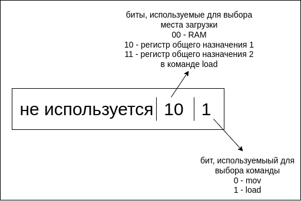

# CTFCup 2022 | Battles / Main | Reverse

## Название

> LogicCTF

## Описание

> Отправить программу на проверку можно на (ip сервиса)/prog (POST raw data). Отправляемая программа не должна быть размером больше 100 байт.

## Раздатка

Бинарный исполняемый файл:

* [public/main](public/main)

## Деплой

```
cd service
docker-compose up --build -d
```

## Решение

Декомпилируем код. По названиям классов можно понять, что бинарь представляет собой эмуляцию 8-битного компьютера на двоичной логике. Программа считывается из файла `rom`, а инициализурующие значения для оперативной памяти из файла `ram`. По работе декодеров команд можно определить, что команды состоят из двух байтов. Первый байт содержит управляющие биты:



Второй байт является данными для загрузки в команде `mov`. Команда `load` загружает данные из RAM в указанный регистр, а команда `mov` загружает значение в регистр адреса RAM. 

После логики работы компьютера в декомпилированном коде идет проверка на то, что если сложить попарно первые 10 значений из RAM, то суммы должны быть равны значениям RAM в ячейках 10-15.

Если суммы не сходятся, то выдается ошибка "wrong answer", иначе флаг из переменной окружения.

Пишем программу для эмулируемого компьютера, которая попарно складывает 10 чисел и сохраняет результат в ячейках RAM 10-15. Отправляем на проверку сервису, получаем флаг.

Пример решения: [sploit](sploit/)

## Флаг

```
Cup{uNd3rst4nding_LOg1c_gaTes_R3QUIRE_l0GiCal_thinking}
```